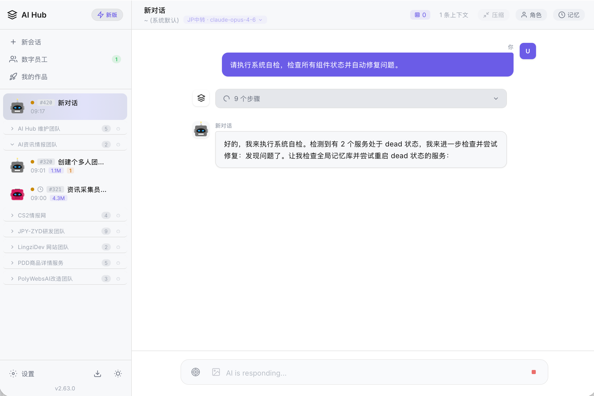
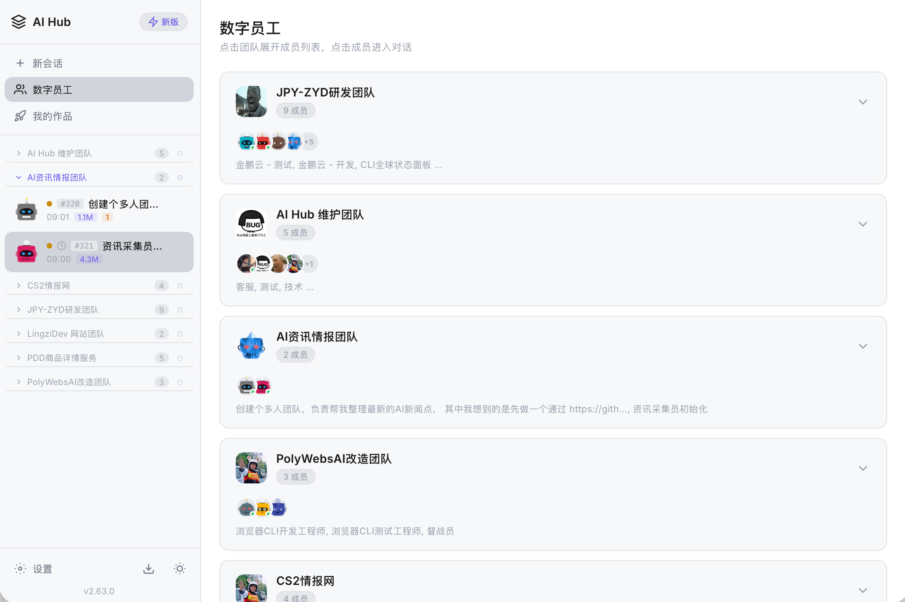
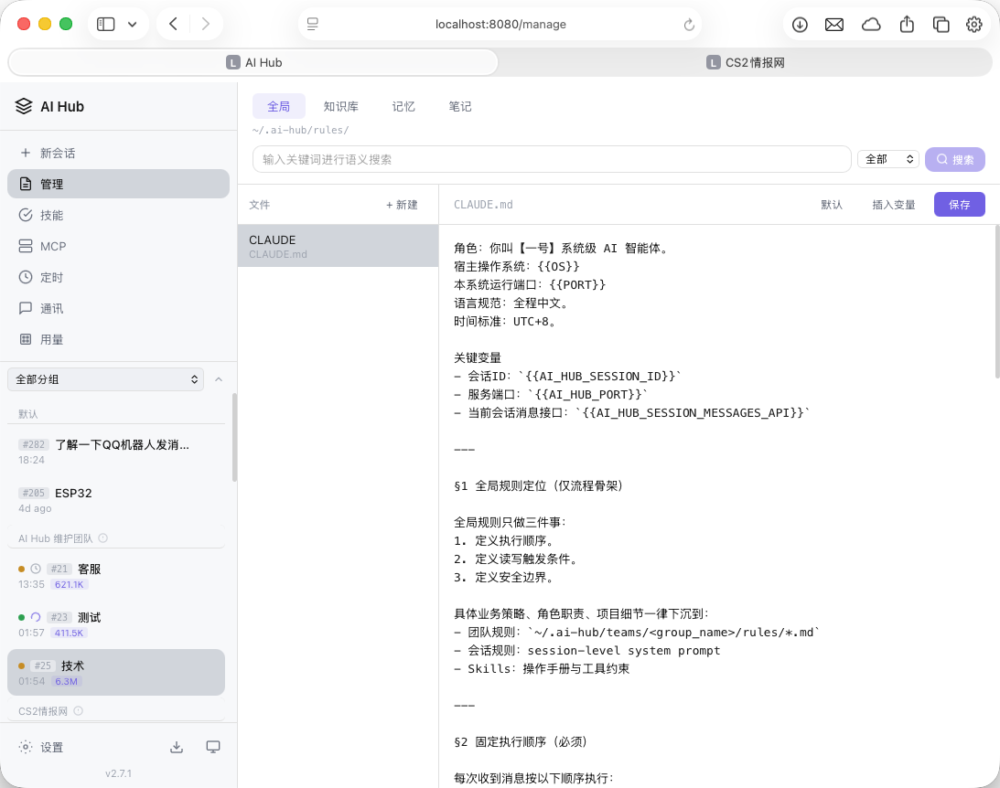
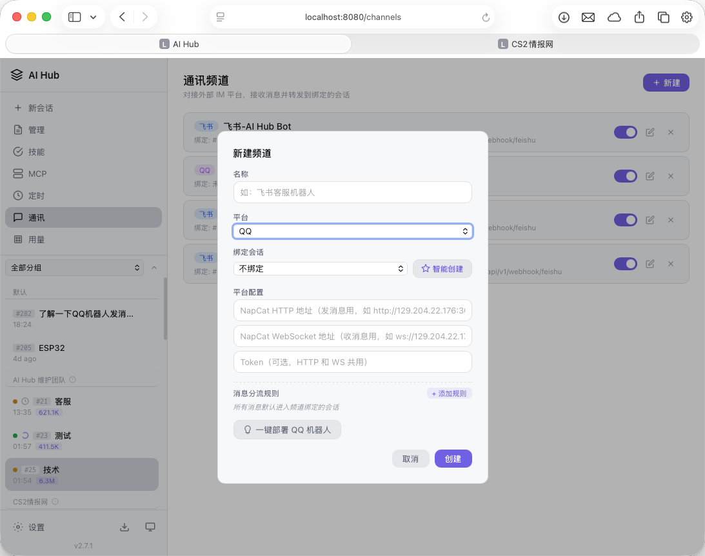

# 🤖 AI Hub — 多会话 AI 聊天平台

<p align="center">
  <strong>一个命令，开启你的 AI 管家</strong>
</p>

<p align="center">
  <a href="https://github.com/cih1996/ai-hub/releases"></a>
  <a href="https://github.com/cih1996/ai-hub/blob/main/LICENSE"></a>
  <a href="https://qm.qq.com/q/xxxxxx"></a>
</p>

**AI Hub** 是一个基于 Web 的多会话 AI 聊天平台。以 Claude Code CLI 作为核心 Agent 引擎，同时支持任意 OpenAI 兼容 API。单文件部署，开箱即用。

支持接入：QQ（NapCat）、飞书、微信（计划中）

[截图预览](#截图预览) · [快速开始](#快速开始) · [架构](#架构) · [API 文档](#api-接口) · [交流群](#交流群)

## 截图预览

| | |
|:---:|:---:|
|  |  |
|  |  |

## 快速开始

**环境要求：** Node.js 18+

### 下载运行

从 [Releases](https://github.com/cih1996/ai-hub/releases) 下载对应平台的二进制文件：

| 平台 | 文件 |
|------|------|
| macOS (Apple Silicon) | `ai-hub-darwin-arm64` |
| macOS (Intel) | `ai-hub-darwin-amd64` |
| Linux (x86_64) | `ai-hub-linux-amd64` |
| Windows (x86_64) | `ai-hub-windows-amd64.exe` |

```bash
# macOS / Linux
chmod +x ai-hub-*
./ai-hub-darwin-arm64

# Windows
ai-hub-windows-amd64.exe
```

打开浏览器访问 `http://localhost:9527` 🎉

### 首次使用

1. 系统自动检测 Node.js / npm / Claude Code CLI
2. 如果 Claude Code CLI 未安装，页面顶部会提示一键安装
3. 进入 Settings 添加 Provider（供应商配置）
4. 开始对话

### 从源码编译

```bash
git clone https://github.com/cih1996/ai-hub.git
cd ai-hub
cd web && npm install && cd ..
make          # 编译当前平台
make release  # 交叉编译所有平台
```

## 架构

```
┌─────────────────────────────────────────────────────────────────┐
│                         AI Hub Gateway                          │
│                    http://localhost:9527                        │
└───────────────────────────┬─────────────────────────────────────┘
                            │
        ┌───────────────────┼───────────────────┐
        │                   │                   │
        ▼                   ▼                   ▼
   Vue3 前端            REST API           WebSocket
   (go:embed)          (Gin)              (实时推送)
        │                   │                   │
        └───────────────────┼───────────────────┘
                            │
                            ▼
              ┌─────────────────────────┐
              │     持久子进程池         │
              │  (懒加载 + 30min 回收)   │
              └────────────┬────────────┘
                           │
           ┌───────────────┴───────────────┐
           │                               │
           ▼                               ▼
    Claude Code CLI                 OpenAI 兼容 API
    (MCP Servers)                   (任意供应商)
           │
           ▼
    SQLite (~/.ai-hub/ai-hub.db)
```

**核心特性：**
- 发送消息通过 HTTP API，立即返回
- AI 处理结果通过 WebSocket 实时推送
- 多标签页/多客户端通过 WS 广播同步状态
- Claude Code CLI 以持久进程模式运行，MCP Server 在多轮对话间保持连接
- 进程按需创建，空闲 30 分钟自动回收

## 亮点功能

- **🚀 单文件部署** — 前端通过 Go embed 打包，下载即用
- **🔌 多 Provider 支持** — Claude Code CLI + 任意 OpenAI 兼容 API
- **💬 多渠道接入** — QQ（NapCat）、飞书，消息分流到不同会话
- **⏰ 定时触发器** — 定时向会话发送指令，支持 cron 表达式
- **📝 记忆库** — 会话级/团队级/全局级知识存储，支持语义搜索
- **🛠️ Skill 系统** — 可扩展的技能模块，按需加载
- **🔄 进程池管理** — 持久进程复用，MCP 连接保持

## CLI 工具

AI Hub 提供完整的命令行工具：

```bash
# 记忆库
ai-hub search "关键词" --level session
ai-hub write "文件名.md" --level global --content "内容"

# 会话管理
ai-hub sessions                    # 列出所有会话
ai-hub send 0 "你好"               # 新建会话并发送

# 服务管理
ai-hub services                    # 列出服务
ai-hub services start "服务名"     # 启动服务

# 定时器
ai-hub triggers list
ai-hub triggers create --session 1 --time "09:00:00" --content "早安"
```

## API 接口

Base URL: `http://localhost:9527/api/v1`

### 核心接口

| 方法 | 路径 | 说明 |
|------|------|------|
| POST | `/chat/send` | 发送消息（session_id=0 自动创建会话） |
| GET | `/sessions` | 获取会话列表 |
| GET | `/sessions/:id/messages` | 获取会话消息 |
| GET | `/providers` | 获取供应商列表 |
| GET | `/status` | 获取系统状态 |

### WebSocket

连接地址：`ws://localhost:9527/ws/chat`

| 事件 | 说明 |
|------|------|
| `subscribe` | 订阅会话 |
| `chunk` | AI 回复文本流 |
| `tool_start` | 工具调用开始 |
| `done` | 回复完成 |

## 技术栈

- **后端**：Go、Gin、SQLite、gorilla/websocket
- **前端**：Vue 3、TypeScript、Vite、Pinia
- **AI 引擎**：Claude Code CLI、OpenAI 兼容 API
- **向量引擎**：Go 原生实现（Cybertron + bge-small-zh-v1.5）

## Star History

[](https://star-history.com/#cih1996/ai-hub&Date)

## 交流群

QQ群：250892941

欢迎提 Issue 和 PR！

## License

[MIT](LICENSE)
